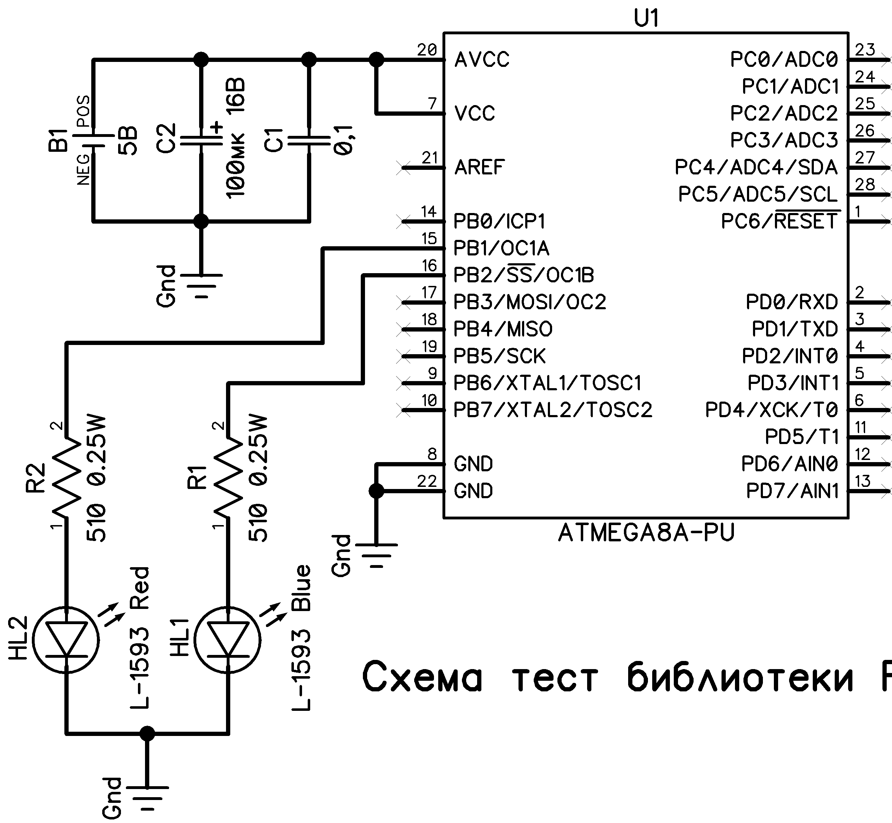

# **Библиотека «диспетчер задач» и «таймерная служба» для CodeVisionAVR**

Эта библиотека является модификацией кода **автора DI HALT** который размещал его в интернете и учебных пособиях.

Бывает трудно рассчитать размер очереди задач и программных таймеров. Поэтому были добавлены небольшие изменения.

## **Что было добавлено**

* Регистрация события **«Переполнение очереди задач»** в фиксированную ячейку **EEPROM** памяти по адресу **@0x00**, в которую будет записано число **0xAA**.

* Регистрация события **«Переполнение очереди программных таймеров »** в фиксированную ячейку **EEPROM** памяти по адресу **@0x01**, в которую будет записано число **0xBB**.

Теперь при работе с этой библиотекой можно узнать об этих событиях через программатор. Для этого нужно соблюдать определённую последовательность действий с программатором:

1. Создать свою прошивку.

2. **«Стирание кристалла».**

3. Выставить конфигурационную ячейку **EESAVE = 1.**

4. **Программирование Fuses**.

5. **«Стирание кристалла».**

6. **Программирование FLASH** и если нужно **EEPROM** памяти.

7. Окончательно выставить **(Lock Bits)** и **(Fuse Bits)**.\
Выставить конфигурационную ячейку **EESAVE = 0**.

8. **Программирование Fuses**.

Если ваше устройство для которого вы делаете прошивку работает не правильно, а в правильности своего кода вы уверены, тогда можно проверить очередь задач и программных таймеров на переполнение:

9. **«Стирание кристалла».**

10. **Чтение EEPROM**-памяти в файл.

11. Открыть файл созданный программатором в какой-нибудь программе, например PonyProg или стандартным блокнотом Windows.

12. Визуально увидеть было или не было переполнения очередей:  
12.1 Если в ячейке по адресу **@0x00** записано число **0xAA**, значит произошло **переполнение очереди задач**.  
12.2 Если в ячейке по адресу **@0x01** записано число **0xBB**, значит произошло **переполнение очереди программных таймеров**.

____

## **Подключение библиотеки**

Для подключения библиотеки к вашему созданному проекту скопируйте файлы **«RTOS.c»** и **«RTOS.h»** в папку с вашим проектом. Далее подключите файл **«RTOS.c»** к вашему проекту в CodeVisionAVR нажав в **меню** ==\> **«Project»**, ==\> **«Configure»**, во вкладке **«Files»** нажмите кнопку **«Add»** и выберите в папке с вашим проектом этот файл. Затем в вашем файле **«.c»** где объявлена функция **«main»** добавьте в нужном месте строку (**#include \<RTOS.h\>**).

После этого нужно настроить файл **«RTOS.h»** указав **размер очереди задач** и  **программных таймеров.** Теперь вы можете вызывать функции библиотеки.

____

Для тестирования библиотеки соберите на монтажной плате схему представленную ниже

В папке **«Тест»** находится пример проекта а также прошивка и установка (**Fuse Bits**) для микроконтроллера. Потребление памяти после компиляции этого проекта представлены ниже.

Все файлы этой библиотеки находятся в папке **«RTOS»**.
Более подробно о работе с диспетчером задач и таймерной службой вы можете прочитать в **учебном пособии автора DI HALT**.
